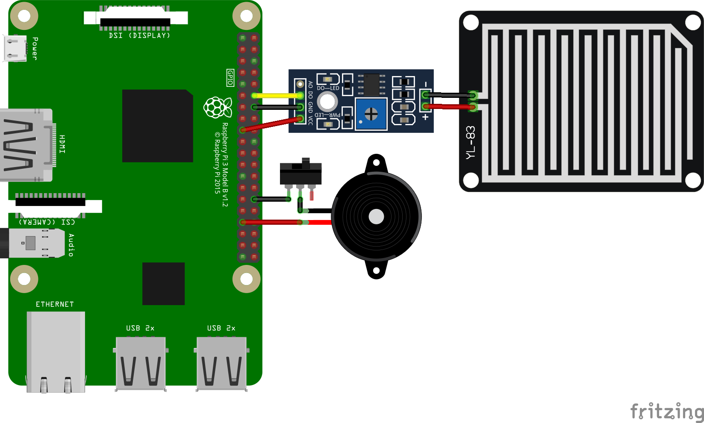

Pi Rain Sensor
==============

# Overview

Detects rain using a sensor which sets a pin to high when dry and low when wet.

Polls sensor every few seconds. Sounds buzzer if rain detected. Activity suspended for some amount of time after buzzer last sounded.

All timings are configurable using constants.

# Usage

## Hardware

* 1 x Active Piezo Buzzer
* 1 x SPST or SPDT Toggle Switch
* 1 x Rain Sensor Board
* 1 x Rain Sensor Controller Board




## Software

### Configure

Check the help to configure details such as the GPIO pins and timings.

```
python3 main.py --help
```

A default tune is included with the project. Additional tunes can be configured by creating a file and loading it with the `--tune` argument.

A tune file contains lines with float values on each line. Each value represents a duration for either a buzzer sound or a sleep. The first line is a sound duration, the second is a sleep duration, and so on.

### Execute

If running with default settings, the program can be easily launched with:

```
./launch.sh
```

Manual execution can be achieved with:

```
python3 main.py
```
